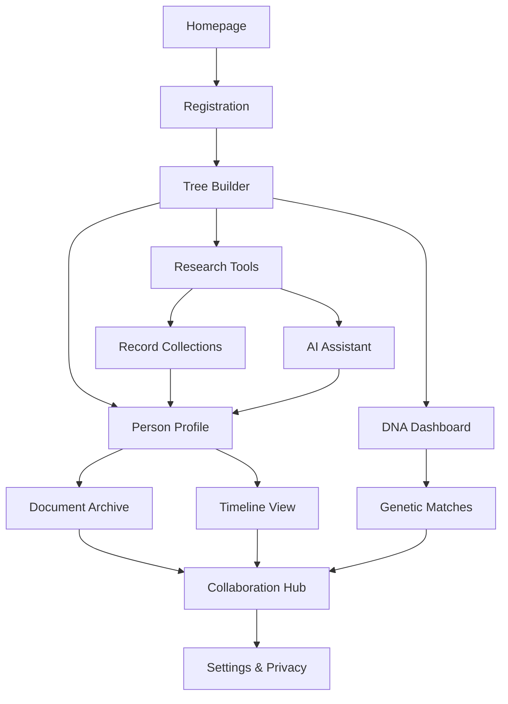
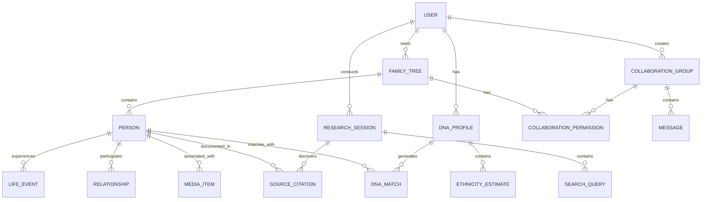
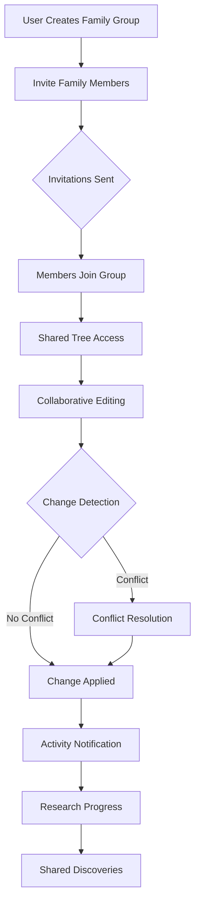
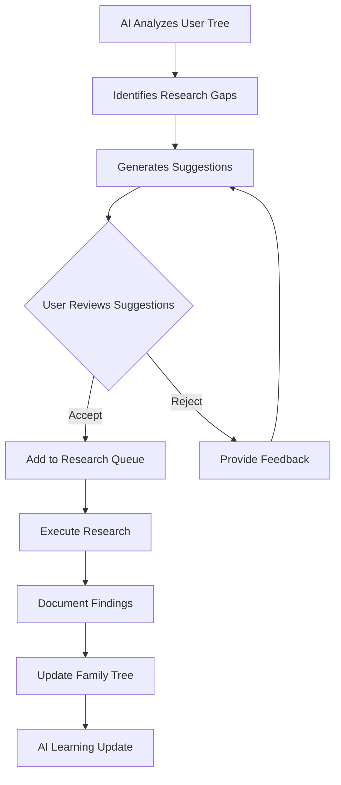

# Genealogy Platform - Product Requirements Document

## 1. Product Overview

The Genealogy Platform is a comprehensive family history research and collaboration tool that enables users to discover, document, and share their family heritage. The platform combines traditional genealogical research with modern DNA analysis, social collaboration features, and AI-powered insights to create a complete family history ecosystem.

**Target Users:** Genealogy enthusiasts, family historians, DNA test recipients, professional researchers, and families seeking to preserve their heritage.

**Market Value:** Addresses the growing $3+ billion genealogy market with a modern, collaborative approach that bridges traditional research with cutting-edge DNA technology and AI assistance.

## 2. Core Features

### 2.1 User Roles

| Role | Registration Method | Core Permissions |
|------|---------------------|------------------|
| Free User | Email/social registration | View public trees, basic search, limited family tree (50 people) |
| Premium User | Subscription upgrade | Unlimited family tree, DNA integration, AI insights, advanced search |
| Professional Researcher | Verification process | Enhanced collaboration tools, client management, advanced analytics |
| Admin | Internal assignment | Platform management, user oversight, content moderation |

### 2.2 Feature Module

The genealogy platform consists of the following main pages:

1. **Homepage**: Hero section, platform overview, featured stories, navigation to key features
2. **Family Tree Builder**: Interactive tree visualization, person management, relationship mapping
3. **Person Profile Page**: Detailed individual information, timeline, photos, documents, DNA connections
4. **DNA Dashboard**: DNA test integration, ethnicity estimates, genetic matches, health insights
5. **Research Tools**: Search interface, record collections, source management, citation tools
6. **Collaboration Hub**: Family groups, messaging, shared trees, permission management
7. **AI Assistant**: Research suggestions, relationship predictions, record hints
8. **Document Archive**: Upload, organize, and tag historical documents and photos
9. **Timeline View**: Chronological family events, historical context, migration patterns
10. **Settings & Privacy**: Account management, privacy controls, data export/import

### 2.3 Page Details

| Page Name | Module Name | Feature description |
|-----------|-------------|---------------------|
| Homepage | Hero Section | Display compelling family history imagery with clear value proposition and CTA buttons for registration and tree creation |
| Homepage | Navigation | Intuitive menu system with access to all major features, user profile, and help resources |
| Homepage | Featured Stories | Showcase interesting user discoveries and success stories to engage visitors |
| Family Tree Builder | Tree Visualization | Interactive graphical representation with drag-and-drop functionality, zoom controls, and multiple view modes (pedigree, descendant, fan chart) |
| Family Tree Builder | Person Management | Add, edit, delete individuals with comprehensive data fields (names, dates, locations, relationships) |
| Family Tree Builder | Relationship Mapping | Automatically calculate and display relationships between any two individuals in the tree |
| Person Profile Page | Biographical Information | Display comprehensive personal details including birth/death dates, locations, occupations, and life events |
| Person Profile Page | Timeline View | Chronological display of life events with historical context and migration patterns |
| Person Profile Page | Media Gallery | Photo and document viewer with tagging, metadata, and version control |
| DNA Dashboard | Ethnicity Estimates | Interactive map and percentage breakdown of genetic ancestry with confidence intervals |
| DNA Dashboard | Genetic Matches | List of DNA matches with relationship predictions, shared DNA amounts, and family tree connections |
| DNA Dashboard | Health Insights | Carrier status reports, wellness traits, and genetic risk factors with educational context |
| Research Tools | Global Search | Search across all records, user trees, and historical databases with advanced filtering |
| Research Tools | Record Collections | Browse categorized historical records (census, immigration, military, vital records) |
| Research Tools | Source Management | Create, organize, and cite research sources with proper genealogical standards |
| Collaboration Hub | Family Groups | Create and manage family groups with shared research goals and communication tools |
| Collaboration Hub | Messaging System | Secure communication between family members with conversation threading and notifications |
| Collaboration Hub | Shared Trees | Collaborative family tree editing with granular permission controls and change tracking |
| AI Assistant | Research Suggestions | AI-powered recommendations for research directions based on existing tree data |
| AI Assistant | Relationship Predictions | Machine learning algorithms to predict unknown relationships based on available data |
| AI Assistant | Record Hints | Automated suggestions for potential record matches based on profile information |
| Document Archive | Upload System | Support for multiple file formats (PDF, JPG, PNG, TIFF) with automatic metadata extraction |
| Document Archive | Organization Tools | Tagging, categorization, and folder-based organization with full-text search |
| Document Archive | OCR Processing | Automatic text extraction from historical documents for improved searchability |
| Timeline View | Family Events | Display all family events across generations with historical context overlay |
| Timeline View | Migration Patterns | Visual representation of family movements with interactive maps and timeline controls |
| Settings & Privacy | Privacy Controls | Granular privacy settings for individual profiles, trees, and shared data |
| Settings & Privacy | Data Management | Import/export functionality for GEDCOM files, data backup, and account deletion |

## 3. Core Process

### User Registration and Tree Creation Flow
1. User lands on homepage and clicks "Start Your Family Tree"
2. Registration form collects basic information (name, email, password)
3. Email verification process confirms account ownership
4. Guided setup wizard helps create first family members
5. User can immediately begin building their tree or skip to explore features

### Research and Discovery Flow
1. User searches for ancestors using global search or specific record collections
2. System displays relevant results with confidence scoring
3. User reviews potential matches and source information
4. User adds confirmed information to their family tree
5. AI assistant suggests additional research opportunities
6. User can share discoveries with family members

### DNA Integration Flow
1. User uploads DNA data file from testing service (23andMe, AncestryDNA, etc.)
2. System processes raw data and generates ethnicity estimates
3. Platform identifies genetic matches within user database
4. User reviews match details and potential family connections
5. System suggests how DNA matches relate to family tree
6. User can contact DNA matches through secure messaging

### Collaboration Flow
1. User creates or joins family group for collaborative research
2. Group members share access to family tree with defined permissions
3. Users can message group members about research progress
4. System tracks changes and contributions from all collaborators
5. Group can collectively work on research goals and share discoveries



## 4. User Interface Design

### 4.1 Design Style
- **Primary Colors**: Deep heritage blue (#1E3A8A) and warm family gold (#F59E0B)
- **Secondary Colors**: Soft cream (#FEF7ED), sage green (#059669), and charcoal gray (#374151)
- **Button Style**: Rounded corners with subtle shadows, primary actions in heritage blue
- **Typography**: Serif fonts (Playfair Display) for headings, sans-serif (Inter) for body text
- **Layout Style**: Card-based design with generous white space and intuitive navigation
- **Icon Style**: Minimalist line icons with historical/genealogical themes

### 4.2 Page Design Overview

| Page Name | Module Name | UI Elements |
|-----------|-------------|-------------|
| Homepage | Hero Section | Full-width family tree visualization with overlay text, prominent CTA buttons, animated elements |
| Family Tree Builder | Tree Visualization | Interactive SVG-based tree with smooth animations, color-coded relationships, responsive design |
| Person Profile Page | Biographical Info | Clean card layout with profile photo, key facts in sidebar, detailed timeline below |
| DNA Dashboard | Ethnicity Map | Interactive world map with color-coded regions, percentage breakdowns, confidence indicators |
| Research Tools | Search Interface | Advanced search form with filters, results displayed in card format with thumbnails |
| Collaboration Hub | Family Groups | Grid layout of family groups with avatars, activity indicators, and quick action buttons |

### 4.3 Responsiveness
- **Desktop-First**: Optimized for desktop usage with extensive tree visualization capabilities
- **Mobile-Adaptive**: Responsive design ensures functionality on tablets and smartphones
- **Touch Optimization**: Enhanced touch interactions for mobile tree navigation and photo viewing
- **Progressive Enhancement**: Core features work on all devices, advanced features on larger screens

## 5. User Stories

### Family Tree Management
**As a** new user  
**I want to** easily create my first family tree  
**So that** I can start documenting my family history

**Acceptance Criteria:**
- Registration process takes less than 2 minutes
- Guided wizard helps add first 3 family members
- Tree visualization appears immediately after first person is added
- User can edit or delete any information entered

**As a** premium user  
**I want to** build an unlimited family tree  
**So that** I can document my complete family history

**Acceptance Criteria:**
- No artificial limits on number of people in tree
- Performance remains smooth with 10,000+ individuals
- Search functionality works across entire tree
- Export functionality handles large trees efficiently

### DNA Integration
**As a** user who has taken a DNA test  
**I want to** upload my DNA results  
**So that** I can discover genetic relatives and ancestry

**Acceptance Criteria:**
- Support for major testing services (23andMe, AncestryDNA, MyHeritage)
- Upload process completes within 5 minutes for typical file sizes
- Ethnicity estimates display with 95% confidence intervals
- Genetic matches show predicted relationships and shared DNA amounts

**As a** user reviewing DNA matches  
**I want to** see how matches relate to my family tree  
**So that** I can validate family connections

**Acceptance Criteria:**
- System identifies potential common ancestors
- Shows path from match to shared ancestor
- Displays confidence level for relationship prediction
- Allows contact through secure messaging system

### Research and Discovery
**As a** family historian  
**I want to** search historical records  
**So that** I can find information about my ancestors

**Acceptance Criteria:**
- Search covers multiple record types (census, immigration, military, vital)
- Results include source information and confidence scoring
- Users can save searches and set up alerts for new matches
- Integration with major genealogical databases

**As a** user who found new information  
**I want to** easily add it to my family tree  
**So that** my research is properly documented

**Acceptance Criteria:**
- One-click addition from search results to tree
- Automatic source citation generation
- Conflict detection for contradictory information
- Version history for all changes

### Collaboration
**As a** family member  
**I want to** share my family tree with relatives  
**So that** we can collaborate on research

**Acceptance Criteria:**
- Granular permission controls (view, edit, admin)
- Invitation system with email notifications
- Activity feed showing all collaborator changes
- Ability to comment on specific individuals or events

**As a** family group administrator  
**I want to** manage group membership and permissions  
**So that** I can maintain control over shared research

**Acceptance Criteria:**
- Dashboard showing all group members and their permissions
- Easy addition and removal of members
- Bulk permission changes
- Audit log of all administrative actions

### AI Assistant
**As a** user stuck in my research  
**I want to** get AI-powered suggestions  
**So that** I can discover new research directions

**Acceptance Criteria:**
- AI analyzes existing tree data and suggests research priorities
- Recommendations include specific records to search
- System explains reasoning behind each suggestion
- Users can provide feedback to improve suggestions

**As a** user with DNA results  
**I want to** get help interpreting genetic matches  
**So that** I can understand complex relationships

**Acceptance Criteria:**
- AI predicts most likely relationship based on shared DNA
- Explains genetic genealogy concepts in plain language
- Suggests next steps for confirming relationships
- Provides confidence levels for all predictions

## 6. Technical Requirements

### System Architecture
The platform follows a microservices architecture with the following components:

- **Frontend Application**: React-based SPA with responsive design
- **API Gateway**: Centralized entry point for all client requests
- **User Service**: Authentication, authorization, and user profile management
- **Family Tree Service**: Core genealogy data management and relationship calculations
- **DNA Service**: DNA data processing, matching algorithms, and ethnicity analysis
- **Research Service**: Historical record integration and search functionality
- **Collaboration Service**: Family groups, messaging, and shared tree management
- **AI Service**: Machine learning models for research suggestions and relationship predictions
- **Document Service**: File storage, OCR processing, and media management
- **Notification Service**: Email notifications, in-app alerts, and system messages
- **Analytics Service**: User behavior tracking and platform metrics

### Performance Requirements
- Page load time: < 2 seconds for all core pages
- Search response time: < 500ms for typical queries
- Tree rendering: < 1 second for trees up to 1,000 people
- DNA processing: < 5 minutes for standard DNA files
- File upload: Support for files up to 100MB with progress indication
- Concurrent users: Support for 10,000+ simultaneous active users

### Scalability Requirements
- Horizontal scaling for all microservices
- Database sharding for user data by geographic region
- CDN integration for static assets and media files
- Caching strategy for frequently accessed data
- Queue-based processing for DNA analysis and AI computations
- Auto-scaling based on traffic patterns and resource utilization

### Security Requirements
- End-to-end encryption for sensitive data (DNA, health information)
- GDPR compliance with data portability and right to deletion
- SOC 2 Type II certification for data security
- Regular security audits and penetration testing
- Multi-factor authentication for all user accounts
- Role-based access control (RBAC) for all system resources
- Audit logging for all data access and modifications

## 7. Database Models

### Core Entities



### Detailed Schema Definitions

**Users Table**
```sql
CREATE TABLE users (
    id UUID PRIMARY KEY DEFAULT gen_random_uuid(),
    email VARCHAR(255) UNIQUE NOT NULL,
    password_hash VARCHAR(255) NOT NULL,
    first_name VARCHAR(100) NOT NULL,
    last_name VARCHAR(100) NOT NULL,
    date_of_birth DATE,
    account_type VARCHAR(20) DEFAULT 'free' CHECK (account_type IN ('free', 'premium', 'professional')),
    email_verified BOOLEAN DEFAULT FALSE,
    privacy_level VARCHAR(20) DEFAULT 'private' CHECK (privacy_level IN ('private', 'public', 'shared')),
    created_at TIMESTAMP WITH TIME ZONE DEFAULT NOW(),
    updated_at TIMESTAMP WITH TIME ZONE DEFAULT NOW(),
    last_login_at TIMESTAMP WITH TIME ZONE,
    is_active BOOLEAN DEFAULT TRUE,
    gdpr_consent BOOLEAN DEFAULT FALSE,
    marketing_consent BOOLEAN DEFAULT FALSE
);
```

**Family Trees Table**
```sql
CREATE TABLE family_trees (
    id UUID PRIMARY KEY DEFAULT gen_random_uuid(),
    user_id UUID REFERENCES users(id) ON DELETE CASCADE,
    name VARCHAR(255) NOT NULL,
    description TEXT,
    privacy_level VARCHAR(20) DEFAULT 'private' CHECK (privacy_level IN ('private', 'public', 'shared')),
    person_count INTEGER DEFAULT 0,
    created_at TIMESTAMP WITH TIME ZONE DEFAULT NOW(),
    updated_at TIMESTAMP WITH TIME ZONE DEFAULT NOW(),
    is_deleted BOOLEAN DEFAULT FALSE,
    deleted_at TIMESTAMP WITH TIME ZONE
);
```

**Persons Table**
```sql
CREATE TABLE persons (
    id UUID PRIMARY KEY DEFAULT gen_random_uuid(),
    tree_id UUID REFERENCES family_trees(id) ON DELETE CASCADE,
    first_name VARCHAR(100) NOT NULL,
    last_name VARCHAR(100) NOT NULL,
    middle_name VARCHAR(100),
    birth_date DATE,
    death_date DATE,
    birth_location VARCHAR(255),
    death_location VARCHAR(255),
    gender VARCHAR(10) CHECK (gender IN ('male', 'female', 'unknown')),
    biography TEXT,
    notes TEXT,
    privacy_level VARCHAR(20) DEFAULT 'private',
    created_at TIMESTAMP WITH TIME ZONE DEFAULT NOW(),
    updated_at TIMESTAMP WITH TIME ZONE DEFAULT NOW(),
    created_by UUID REFERENCES users(id),
    is_deleted BOOLEAN DEFAULT FALSE
);
```

**DNA Profiles Table**
```sql
CREATE TABLE dna_profiles (
    id UUID PRIMARY KEY DEFAULT gen_random_uuid(),
    user_id UUID REFERENCES users(id) ON DELETE CASCADE,
    testing_company VARCHAR(50) NOT NULL,
    upload_date TIMESTAMP WITH TIME ZONE DEFAULT NOW(),
    file_hash VARCHAR(255) UNIQUE NOT NULL,
    processing_status VARCHAR(20) DEFAULT 'pending',
    ethnicity_version VARCHAR(10),
    match_count INTEGER DEFAULT 0,
    is_public BOOLEAN DEFAULT FALSE,
    created_at TIMESTAMP WITH TIME ZONE DEFAULT NOW(),
    updated_at TIMESTAMP WITH TIME ZONE DEFAULT NOW()
);
```

**Ethnicity Estimates Table**
```sql
CREATE TABLE ethnicity_estimates (
    id UUID PRIMARY KEY DEFAULT gen_random_uuid(),
    dna_profile_id UUID REFERENCES dna_profiles(id) ON DELETE CASCADE,
    region VARCHAR(100) NOT NULL,
    percentage DECIMAL(5,2) NOT NULL,
    confidence_score DECIMAL(3,2),
    created_at TIMESTAMP WITH TIME ZONE DEFAULT NOW()
);
```

**Collaboration Groups Table**
```sql
CREATE TABLE collaboration_groups (
    id UUID PRIMARY KEY DEFAULT gen_random_uuid(),
    name VARCHAR(255) NOT NULL,
    description TEXT,
    created_by UUID REFERENCES users(id),
    member_count INTEGER DEFAULT 1,
    tree_count INTEGER DEFAULT 0,
    privacy_level VARCHAR(20) DEFAULT 'private',
    created_at TIMESTAMP WITH TIME ZONE DEFAULT NOW(),
    updated_at TIMESTAMP WITH TIME ZONE DEFAULT NOW()
);
```

### Indexing Strategy
```sql
-- Performance indexes
CREATE INDEX idx_users_email ON users(email);
CREATE INDEX idx_users_active ON users(is_active) WHERE is_active = TRUE;
CREATE INDEX idx_family_trees_user ON family_trees(user_id);
CREATE INDEX idx_persons_tree ON persons(tree_id);
CREATE INDEX idx_persons_name ON persons(last_name, first_name);
CREATE INDEX idx_dna_profiles_user ON dna_profiles(user_id);
CREATE INDEX idx_dna_matches_profile ON dna_matches(dna_profile_id);
CREATE INDEX idx_collaboration_permissions_user ON collaboration_permissions(user_id);

-- Full-text search indexes
CREATE INDEX idx_persons_search ON persons USING gin(to_tsvector('english', 
    coalesce(first_name,'') || ' ' || coalesce(last_name,'') || ' ' || coalesce(biography,'')));

-- Geographic indexes for location-based searches
CREATE INDEX idx_persons_birth_location ON persons USING gin(birth_location gin_trgm_ops);
CREATE INDEX idx_persons_death_location ON persons USING gin(death_location gin_trgm_ops);
```

## 8. User Flows

### Complete Registration Journey
```mermaid
graph TD
    A[Visitor Lands on Homepage] --> B{Clicks "Start Family Tree"}
    B --> C[Registration Form]
    C --> D{Email Validation}
    D -->|Valid| E[Account Created]
    D -->|Invalid| C
    E --> F[Welcome Email Sent]
    F --> G[Guided Setup Wizard]
    G --> H{Add First Family Member}
    H -->|Complete| I[Tree Created]
    H -->|Skip| J[Explore Features]
    I --> K[Dashboard Tour]
    J --> K
    K --> L[Onboarding Complete]
```

### DNA Upload and Analysis Flow
```mermaid
graph TD
    A[User Navigates to DNA Dashboard] --> B[Click "Upload DNA Data"]
    B --> C[Select Testing Company]
    C --> D[Drag & Drop or Browse File]
    D --> E{File Validation}
    E -->|Invalid| F[Error Message]
    E -->|Valid| G[Upload Progress]
    G --> H[File Processing Started]
    H --> I{Processing Status}
    I -->|Pending| J[Email Notification: Processing]
    I -->|Complete| K[Ethnicity Analysis]
    K --> L[Genetic Matching]
    L --> M[Results Dashboard]
    M --> N[Match Review]
    N --> O[Tree Integration]
```

### Collaborative Research Flow


### AI-Powered Research Suggestions


## 9. Feature Workflows

### Family Tree Building Workflow
1. **Tree Initialization**
   - User creates new family tree with name and description
   - System assigns unique identifier and sets up basic structure
   - Default privacy settings applied based on user preferences

2. **Person Addition**
   - User clicks "Add Person" button in tree view
   - Modal form collects basic information (name, birth/death dates)
   - System validates data and checks for potential duplicates
   - Person added to tree with unique identifier and relationships

3. **Relationship Mapping**
   - User connects people by specifying relationship types
   - System calculates and validates relationship logic
   - Automatic relationship inference for missing connections
   - Bidirectional relationship creation (parent-child, spouses)

4. **Data Enrichment**
   - User adds detailed information to person profiles
   - Life events, biographical notes, and source citations
   - Media attachments (photos, documents, audio)
   - Geographic information with map integration

5. **Quality Assurance**
   - System performs consistency checks on dates and relationships
   - Alerts user to potential errors or conflicts
   - Suggests improvements based on genealogical standards
   - Provides confidence scoring for information reliability

### DNA Analysis Workflow
1. **Data Ingestion**
   - Raw DNA file uploaded and stored securely
   - File format validation and integrity checking
   - Metadata extraction (testing company, test type, upload date)
   - Encryption of sensitive genetic data

2. **Processing Pipeline**
   - DNA data normalized to standard format
   - Quality control metrics calculated
   - SNP matching against reference database
   - Ethnicity estimation algorithms applied

3. **Match Discovery**
   - Comparison against existing user DNA profiles
   - Shared DNA segment identification
   - Relationship probability calculations
   - Confidence scoring for match quality

4. **Results Generation**
   - Ethnicity breakdown with geographic regions
   - List of genetic matches ranked by relationship probability
   - Detailed match information including shared DNA amounts
   - Integration suggestions with family tree data

5. **Privacy Controls**
   - User controls over match visibility and contact permissions
   - Opt-in requirements for different levels of sharing
   - Data anonymization options for research participation
   - Complete data deletion capabilities

### Research Discovery Workflow
1. **Search Initiation**
   - User enters search criteria (names, dates, locations)
   - Advanced filters applied (record type, date range, geography)
   - AI suggestions based on existing tree data
   - Saved search functionality for repeated queries

2. **Record Matching**
   - System queries multiple historical databases
   - Fuzzy matching algorithms handle name variations
   - Geographic proximity calculations
   - Temporal relevance scoring

3. **Result Presentation**
   - Ranked list of potential matches
   - Source information and document previews
   - Confidence scoring for each match
   - Comparison with existing tree data

4. **Validation Process**
   - User reviews match details and source quality
   - Cross-reference with other records when available
   - Community feedback and ratings
   - Expert verification for important discoveries

5. **Integration and Documentation**
   - One-click addition to family tree
   - Automatic source citation generation
   - Linking to original documents
   - Update notifications for collaborators

### Collaboration Management Workflow
1. **Group Formation**
   - User creates family group with name and description
   - Invitation system with customizable messages
   - Privacy settings and membership approval process
   - Welcome sequence for new members

2. **Permission Management**
   - Granular access controls (view, edit, admin)
   - Tree-level and person-level permissions
   - Approval workflows for sensitive changes
   - Audit logging for all administrative actions

3. **Collaborative Editing**
   - Real-time conflict detection and resolution
   - Change tracking with user attribution
   - Comment system for discussions
   - Version history with rollback capabilities

4. **Communication Tools**
   - Integrated messaging system
   - Notification preferences by event type
   - @mentions and threading support
   - Email digest options for activity summaries

5. **Progress Tracking**
   - Shared research goals and milestones
   - Activity dashboards showing contributions
   - Research task assignment and completion
   - Celebration of discoveries and achievements

## 10. Security Requirements

### GDPR Compliance Framework

**Data Protection Principles**
- **Lawfulness**: All data processing based on legitimate interests or explicit consent
- **Fairness**: Transparent data practices with clear user benefits
- **Transparency**: Comprehensive privacy policy in plain language
- **Purpose Limitation**: Data used only for stated genealogical purposes
- **Data Minimization**: Collection limited to necessary information
- **Accuracy**: Mechanisms for users to correct and update their data
- **Storage Limitation**: Data retained only as long as necessary
- **Integrity and Confidentiality**: Appropriate security measures implemented

**User Rights Implementation**
- **Right to Access**: Users can download complete data within 30 days
- **Right to Rectification**: Easy correction of inaccurate personal data
- **Right to Erasure**: Complete account deletion including all associated data
- **Right to Restrict Processing**: Users can limit how their data is used
- **Right to Data Portability**: GEDCOM export and structured data downloads
- **Right to Object**: Opt-out mechanisms for various data uses
- **Right to Not Be Profiled**: Controls over automated decision-making

**Consent Management**
- Granular consent options for different data uses
- Clear distinction between required and optional consents
- Easy withdrawal of consent at any time
- Separate consent for marketing communications
- Special protections for children's data
- Consent records maintained for audit purposes

### Privacy by Design

**Data Anonymization**
- Automatic anonymization of DNA data for research purposes
- Pseudonymization of user identities in shared contexts
- Aggregation of demographic data for analytics
- Differential privacy techniques for statistical reporting

**Access Controls**
- Role-based permissions with principle of least privilege
- Multi-factor authentication for sensitive operations
- Session management with automatic timeouts
- IP whitelisting for administrative access
- Regular access review and revocation processes

**Encryption Standards**
- TLS 1.3 for all data in transit
- AES-256 encryption for data at rest
- End-to-end encryption for messaging
- Secure key management with rotation
- Hardware security modules for critical keys

**Audit and Monitoring**
- Comprehensive logging of all data access
- Real-time security event monitoring
- Automated threat detection and response
- Regular security assessments and penetration testing
- Incident response procedures with notification requirements

### Data Security Measures

**Infrastructure Security**
- Cloud infrastructure with SOC 2 compliance
- Network segmentation and micro-segmentation
- DDoS protection and traffic filtering
- Regular vulnerability scanning and patching
- Secure backup and disaster recovery procedures

**Application Security**
- Secure coding practices and code review processes
- Dependency scanning for known vulnerabilities
- Input validation and sanitization
- SQL injection prevention measures
- Cross-site scripting (XSS) protection
- Cross-site request forgery (CSRF) tokens

**Operational Security**
- Security awareness training for all staff
- Background checks for personnel with data access
- Secure development lifecycle integration
- Change management procedures
- Regular security audits and assessments

## 11. Success Metrics

### Key Performance Indicators (KPIs)

**User Acquisition and Engagement**
- **Monthly Active Users (MAU)**: Target 100,000 within first year
- **User Registration Rate**: 15% of visitors complete registration
- **User Retention**: 60% monthly retention for active users
- **Session Duration**: Average 25 minutes per session
- **Pages per Session**: Average 8 pages per visit
- **Feature Adoption**: 70% of users try DNA integration within 30 days

**Tree Building Metrics**
- **Trees Created**: 50,000 family trees in first 6 months
- **Average Tree Size**: 150 people per tree for active users
- **Tree Growth Rate**: 10% monthly increase in average tree size
- **Data Quality Score**: 85% of profiles have complete basic information
- **Source Documentation**: 70% of facts have attached sources
- **Collaboration Rate**: 40% of users participate in family groups

**DNA Integration Success**
- **DNA Upload Rate**: 30% of users upload DNA data
- **Match Discovery**: Average 1,200 genetic matches per user
- **Match Engagement**: 25% of users contact genetic matches
- **Tree Integration**: 60% of DNA matches linked to family tree
- **Ethnicity Accuracy**: 95% user satisfaction with ethnicity estimates
- **Health Insights Engagement**: 40% of users explore health-related features

**Research and Discovery**
- **Search Volume**: 500,000 searches per month
- **Search Success Rate**: 35% of searches lead to tree additions
- **Record Integration**: 200,000 historical records added monthly
- **AI Suggestion Adoption**: 45% of AI recommendations acted upon
- **Discovery Sharing**: 60% of users share discoveries with family
- **Research Completion**: 25% of research goals achieved within 30 days

**Collaboration and Community**
- **Family Groups Created**: 15,000 active family groups
- **Group Engagement**: Average 8 members per group
- **Collaborative Editing**: 100,000 collaborative changes per month
- **Message Volume**: 50,000 messages sent monthly
- **Community Support**: 80% of user questions answered within 24 hours
- **User-Generated Content**: 10,000 stories and discoveries shared monthly

**Business and Revenue Metrics**
- **Conversion Rate**: 8% of free users upgrade to premium
- **Customer Lifetime Value (CLV)**: $180 average for premium users
- **Customer Acquisition Cost (CAC)**: $25 per premium user
- **Monthly Recurring Revenue (MRR)**: $500,000 by end of year one
- **Churn Rate**: < 5% monthly churn for premium subscribers
- **Net Promoter Score (NPS)**: 65+ indicating strong user satisfaction

### Measurement and Analytics Framework

**Data Collection Strategy**
- Anonymous usage analytics for all user interactions
- Event tracking for key user actions and milestones
- Performance monitoring for all system components
- Error logging and crash reporting
- A/B testing framework for feature optimization
- User feedback collection through surveys and interviews

**Reporting and Dashboards**
- Real-time operational dashboards for system health
- Daily executive summary of key metrics
- Weekly detailed reports on user engagement
- Monthly business performance reviews
- Quarterly strategic analysis and recommendations
- Annual comprehensive platform assessment

**Continuous Improvement Process**
- Regular metric review meetings with stakeholders
- Hypothesis-driven experimentation framework
- User research integration with quantitative metrics
- Competitive benchmarking and market analysis
- ROI analysis for all major features and initiatives
- Predictive analytics for user behavior and churn prevention

### Success Criteria by Phase

**Phase 1: Launch (Months 1-3)**
- 25,000 registered users
- 15,000 active family trees
- 90% uptime and system reliability
- User satisfaction score > 4.0/5.0
- Basic feature set fully functional

**Phase 2: Growth (Months 4-9)**
- 75,000 registered users
- 50,000 active family trees
- DNA integration launched and stable
- 20% premium conversion rate
- Mobile apps released and adopted

**Phase 3: Maturity (Months 10-12)**
- 150,000 registered users
- 100,000 active family trees
- AI features fully deployed
- Break-even achieved financially
- Market leadership established in key segments

This comprehensive product requirements document serves as the foundation for developing a world-class genealogy platform that combines traditional family history research with modern DNA analysis, AI-powered insights, and collaborative features to create an engaging and valuable