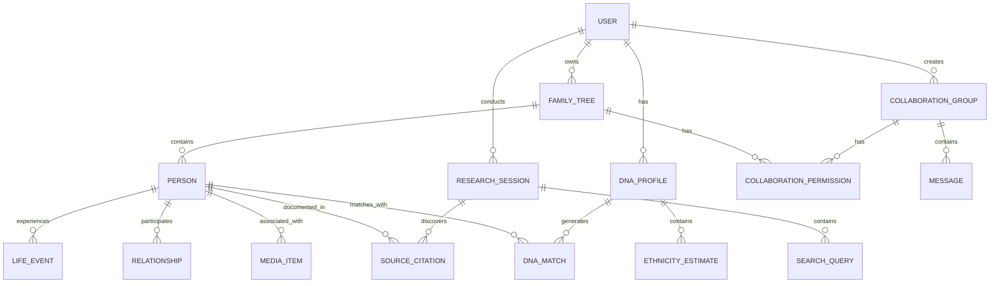

# Genealogy Platform - Technical Architecture Document

## 1. System Architecture Overview

The genealogy platform follows a modern microservices architecture designed for scalability, security, and performance. The system is built using React + TypeScript for the frontend and Node.js + Express for the backend, with PostgreSQL as the primary database and Supabase for additional backend services.

### 1.1 High-Level Architecture

```
┌─────────────────────────────────────────────────────────────────┐
│                        Frontend Layer                           │
├─────────────────────────────────────────────────────────────────┤
│  React + TypeScript • Responsive Design • PWA Capabilities     │
│  Zustand State Management • React Query • React Hook Form     │
└─────────────────────────────────────────────────────────────────┘
                               │
┌─────────────────────────────────────────────────────────────────┐
│                      API Gateway Layer                         │
├─────────────────────────────────────────────────────────────────┤
│  Express.js • JWT Authentication • Rate Limiting • Helmet    │
│  CORS • Request Validation • Error Handling • Logging         │
└─────────────────────────────────────────────────────────────────┘
                               │
┌─────────────────────────────────────────────────────────────────┐
│                     Microservices Layer                        │
├─────────────────────────────────────────────────────────────────┤
│  User Service • Family Tree Service • DNA Service            │
│  Research Service • Collaboration Service • AI Service       │
│  Media Service • Notification Service • Analytics Service     │
└─────────────────────────────────────────────────────────────────┘
                               │
┌─────────────────────────────────────────────────────────────────┐
│                      Data Layer                                │
├─────────────────────────────────────────────────────────────────┤
│  PostgreSQL • Supabase • Redis Cache • Elasticsearch          │
│  S3 File Storage • JWT Tokens • Session Management            │
└─────────────────────────────────────────────────────────────────┘
```

### 1.2 Technology Stack

**Frontend Technologies:**
- React 18 with TypeScript for type safety
- Vite for fast development and building
- Tailwind CSS for responsive styling
- Zustand for state management
- React Router for navigation
- React Hook Form for form handling
- Recharts for data visualization
- Sonner for notifications

**Backend Technologies:**
- Node.js with Express.js framework
- TypeScript for type safety
- PostgreSQL with Drizzle ORM
- Supabase for authentication and real-time features
- Redis for caching and session management
- Socket.io for real-time communication
- JWT for authentication tokens

**Infrastructure & Services:**
- Docker for containerization
- AWS S3 for file storage
- Stripe for payment processing
- SendGrid for email services
- Elasticsearch for search functionality
- Cloudinary for image processing

## 2. Microservices Architecture

### 2.1 User Service
Handles user authentication, authorization, and profile management.

**Responsibilities:**
- User registration and login
- OAuth integration (Google, Apple)
- Profile management
- Password reset
- Email verification
- Subscription management

**API Endpoints:**
```
POST /api/auth/register
POST /api/auth/login
POST /api/auth/logout
POST /api/auth/refresh
GET  /api/auth/profile
PUT  /api/auth/profile
POST /api/auth/forgot-password
POST /api/auth/reset-password
```

### 2.2 Family Tree Service
Manages family tree data, relationships, and genealogical information.

**Responsibilities:**
- Tree creation and management
- Person profile management
- Relationship mapping
- Tree visualization data
- GEDCOM import/export
- Tree sharing and permissions

**API Endpoints:**
```
GET    /api/trees
POST   /api/trees
GET    /api/trees/:id
PUT    /api/trees/:id
DELETE /api/trees/:id
GET    /api/trees/:id/persons
POST   /api/persons
GET    /api/persons/:id
PUT    /api/persons/:id
DELETE /api/persons/:id
```

### 2.3 DNA Service
Processes DNA data, ethnicity estimates, and genetic matching.

**Responsibilities:**
- DNA file upload and processing
- Ethnicity analysis
- Genetic matching algorithms
- DNA match management
- Privacy controls
- Health insights (optional)

**API Endpoints:**
```
POST /api/dna/upload
GET  /api/dna/profile
GET  /api/dna/ethnicity
GET  /api/dna/matches
GET  /api/dna/matches/:id
POST /api/dna/matches/:id/contact
```

### 2.4 Research Service
Historical record search and research tools.

**Responsibilities:**
- Record search and filtering
- Source management
- Citation generation
- Research suggestions
- Historical database integration

**API Endpoints:**
```
GET  /api/research/search
GET  /api/research/records/:id
POST /api/research/sources
GET  /api/research/sources
PUT  /api/research/sources/:id
GET  /api/research/suggestions
```

### 2.5 Collaboration Service
Family group management and collaborative features.

**Responsibilities:**
- Family group creation
- Member invitation and management
- Shared tree editing
- Messaging system
- Activity tracking
- Permission management

**API Endpoints:**
```
GET    /api/groups
POST   /api/groups
GET    /api/groups/:id
PUT    /api/groups/:id
DELETE /api/groups/:id
POST   /api/groups/:id/invite
GET    /api/groups/:id/members
POST   /api/groups/:id/messages
GET    /api/groups/:id/messages
```

### 2.6 AI Service
Machine learning models for research assistance and relationship predictions.

**Responsibilities:**
- Research suggestion generation
- Relationship prediction
- Record matching
- Natural language processing
- User behavior analysis

**API Endpoints:**
```
GET  /api/ai/suggestions
POST /api/ai/relationship-prediction
GET  /api/ai/record-matches
POST /api/ai/feedback
```

### 2.7 Media Service
File upload, processing, and management.

**Responsibilities:**
- Photo and document upload
- Image processing and optimization
- OCR text extraction
- File organization
- Storage management

**API Endpoints:**
```
POST /api/media/upload
GET  /api/media/:id
PUT  /api/media/:id
DELETE /api/media/:id
GET  /api/media/person/:personId
```

### 2.8 Notification Service
Email notifications and in-app alerts.

**Responsibilities:**
- Email notification sending
- In-app notification management
- Push notification setup
- Notification preferences
- Template management

**API Endpoints:**
```
GET  /api/notifications
PUT  /api/notifications/:id/read
POST /api/notifications/preferences
GET  /api/notifications/preferences
```

## 3. Database Design

### 3.1 Database Schema Overview



### 3.2 Core Tables

**Users Table**
```sql
CREATE TABLE users (
    id UUID PRIMARY KEY DEFAULT gen_random_uuid(),
    email VARCHAR(255) UNIQUE NOT NULL,
    password_hash VARCHAR(255) NOT NULL,
    first_name VARCHAR(100) NOT NULL,
    last_name VARCHAR(100) NOT NULL,
    date_of_birth DATE,
    account_type VARCHAR(20) DEFAULT 'free' CHECK (account_type IN ('free', 'premium', 'professional')),
    email_verified BOOLEAN DEFAULT FALSE,
    privacy_level VARCHAR(20) DEFAULT 'private' CHECK (privacy_level IN ('private', 'public', 'shared')),
    created_at TIMESTAMP WITH TIME ZONE DEFAULT NOW(),
    updated_at TIMESTAMP WITH TIME ZONE DEFAULT NOW(),
    last_login_at TIMESTAMP WITH TIME ZONE,
    is_active BOOLEAN DEFAULT TRUE,
    gdpr_consent BOOLEAN DEFAULT FALSE,
    marketing_consent BOOLEAN DEFAULT FALSE
);
```

**Family Trees Table**
```sql
CREATE TABLE family_trees (
    id UUID PRIMARY KEY DEFAULT gen_random_uuid(),
    user_id UUID REFERENCES users(id) ON DELETE CASCADE,
    name VARCHAR(255) NOT NULL,
    description TEXT,
    privacy_level VARCHAR(20) DEFAULT 'private' CHECK (privacy_level IN ('private', 'public', 'shared')),
    person_count INTEGER DEFAULT 0,
    created_at TIMESTAMP WITH TIME ZONE DEFAULT NOW(),
    updated_at TIMESTAMP WITH TIME ZONE DEFAULT NOW(),
    is_deleted BOOLEAN DEFAULT FALSE,
    deleted_at TIMESTAMP WITH TIME ZONE
);
```

**Persons Table**
```sql
CREATE TABLE persons (
    id UUID PRIMARY KEY DEFAULT gen_random_uuid(),
    tree_id UUID REFERENCES family_trees(id) ON DELETE CASCADE,
    first_name VARCHAR(100) NOT NULL,
    last_name VARCHAR(100) NOT NULL,
    middle_name VARCHAR(100),
    birth_date DATE,
    death_date DATE,
    birth_location VARCHAR(255),
    death_location VARCHAR(255),
    gender VARCHAR(10) CHECK (gender IN ('male', 'female', 'unknown')),
    biography TEXT,
    notes TEXT,
    privacy_level VARCHAR(20) DEFAULT 'private',
    created_at TIMESTAMP WITH TIME ZONE DEFAULT NOW(),
    updated_at TIMESTAMP WITH TIME ZONE DEFAULT NOW(),
    created_by UUID REFERENCES users(id),
    is_deleted BOOLEAN DEFAULT FALSE
);
```

### 3.3 Indexing Strategy

```sql
-- Performance indexes
CREATE INDEX idx_users_email ON users(email);
CREATE INDEX idx_users_active ON users(is_active) WHERE is_active = TRUE;
CREATE INDEX idx_family_trees_user ON family_trees(user_id);
CREATE INDEX idx_persons_tree ON persons(tree_id);
CREATE INDEX idx_persons_name ON persons(last_name, first_name);
CREATE INDEX idx_dna_profiles_user ON dna_profiles(user_id);
CREATE INDEX idx_dna_matches_profile ON dna_matches(dna_profile_id);
CREATE INDEX idx_collaboration_permissions_user ON collaboration_permissions(user_id);

-- Full-text search indexes
CREATE INDEX idx_persons_search ON persons USING gin(to_tsvector('english', 
    coalesce(first_name,'') || ' ' || coalesce(last_name,'') || ' ' || coalesce(biography,'')));

-- Geographic indexes for location-based searches
CREATE INDEX idx_persons_birth_location ON persons USING gin(birth_location gin_trgm_ops);
CREATE INDEX idx_persons_death_location ON persons USING gin(death_location gin_trgm_ops);
```

## 4. Security Architecture

### 4.1 Authentication & Authorization

**JWT Token Structure**
```typescript
interface JWTPayload {
  userId: string;
  email: string;
  accountType: 'free' | 'premium' | 'professional';
  permissions: string[];
  iat: number;
  exp: number;
}
```

**OAuth Integration**
- Google OAuth 2.0 for social login
- Apple Sign-In for iOS users
- Email/password with bcrypt hashing
- Multi-factor authentication support

### 4.2 Data Protection

**Encryption Standards**
- TLS 1.3 for data in transit
- AES-256 for data at rest
- End-to-end encryption for messaging
- Secure key management with rotation

**GDPR Compliance**
- User consent management
- Data portability (GEDCOM export)
- Right to erasure implementation
- Privacy by design principles
- Audit logging for data access

### 4.3 Security Headers

```typescript
// Helmet.js configuration
app.use(helmet({
  contentSecurityPolicy: {
    directives: {
      defaultSrc: ["'self'"],
      styleSrc: ["'self'", "'unsafe-inline'"],
      scriptSrc: ["'self'"],
      imgSrc: ["'self'", "data:", "https:"],
      connectSrc: ["'self'"],
      fontSrc: ["'self'"],
      objectSrc: ["'none'"],
      mediaSrc: ["'self'"],
      frameSrc: ["'none'"],
    },
  },
  hsts: {
    maxAge: 31536000,
    includeSubDomains: true,
    preload: true
  }
}));
```

## 5. Performance Optimization

### 5.1 Caching Strategy

**Redis Cache Layers**
- Session storage: `session:${userId}`
- User profiles: `user:${userId}`
- Tree data: `tree:${treeId}`
- Search results: `search:${queryHash}`
- DNA matches: `dna:matches:${profileId}`

**Cache TTL Settings**
- User sessions: 24 hours
- User profiles: 1 hour
- Tree data: 30 minutes
- Search results: 15 minutes
- DNA matches: 4 hours

### 5.2 Database Optimization

**Query Optimization**
- Indexed foreign keys and search fields
- Materialized views for complex reports
- Connection pooling with optimal settings
- Query result pagination
- Database sharding for scalability

### 5.3 Frontend Optimization

**Code Splitting**
- Route-based code splitting
- Component lazy loading
- Vendor chunk optimization
- Dynamic imports for heavy components

**Image Optimization**
- WebP format with fallbacks
- Responsive images with srcset
- Lazy loading for off-screen images
- CDN integration for static assets

## 6. Monitoring and Observability

### 6.1 Application Monitoring

**Metrics Collection**
- Request latency and throughput
- Error rates and types
- Database query performance
- Cache hit/miss ratios
- User engagement metrics

**Logging Strategy**
- Structured JSON logging
- Correlation IDs for request tracing
- Log levels (ERROR, WARN, INFO, DEBUG)
- Centralized log aggregation
- Log retention policies

### 6.2 Health Checks

```typescript
// Health check endpoints
GET /health/live    // Liveness probe
GET /health/ready   // Readiness probe
GET /health/startup // Startup probe
```

### 6.3 Alerting

**Critical Alerts**
- Database connection failures
- High error rates (>5%)
- Response time degradation
- Memory usage spikes
- Disk space warnings

## 7. Deployment Architecture

### 7.1 Container Strategy

**Docker Configuration**
```dockerfile
# Multi-stage build for optimization
FROM node:18-alpine AS builder
WORKDIR /app
COPY package*.json ./
RUN npm ci --only=production

FROM node:18-alpine AS runtime
WORKDIR /app
COPY --from=builder /app/node_modules ./node_modules
COPY . .
EXPOSE 3000
CMD ["npm", "start"]
```

### 7.2 Environment Configuration

**Development Environment**
- Hot reload for rapid development
- Debug logging enabled
- Local database with seed data
- Mock external services

**Production Environment**
- Optimized builds with minification
- CDN for static assets
- Database connection pooling
- Health checks and monitoring
- Auto-scaling configuration

### 7.3 CI/CD Pipeline

**Build Process**
1. Code quality checks (ESLint, TypeScript)
2. Unit test execution
3. Integration test execution
4. Security vulnerability scanning
5. Docker image building
6. Deployment to staging
7. Automated smoke tests
8. Production deployment

## 8. Scalability Considerations

### 8.1 Horizontal Scaling

**Load Balancing**
- Round-robin request distribution
- Health-based routing
- Session affinity for WebSocket connections
- Geographic distribution

**Database Scaling**
- Read replicas for query distribution
- Connection pooling optimization
- Query result caching
- Database sharding strategy

### 8.2 Vertical Scaling

**Resource Allocation**
- CPU optimization for compute-intensive operations
- Memory management for large datasets
- I/O optimization for file uploads
- Network bandwidth management

This technical architecture document provides the foundation for building a robust, scalable, and secure genealogy platform that can handle millions of users while maintaining excellent performance and user experience.